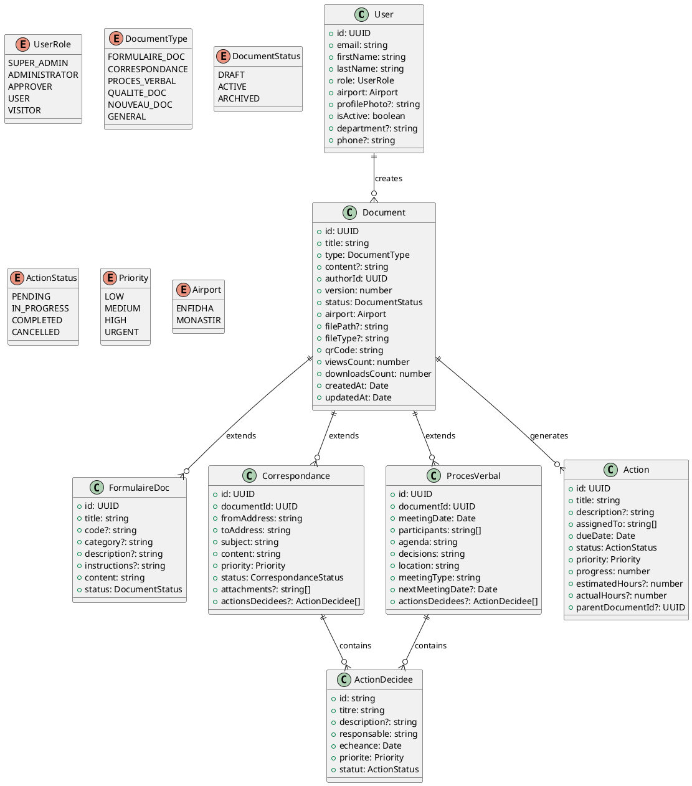

# Documentation Technique - AeroDoc

## Table des matières
1. [Vue d'ensemble](#vue-densemble)
2. [Architecture du système](#architecture-du-système)
3. [Diagramme UML](#diagramme-uml)
4. [Modèle de données](#modèle-de-données)
5. [Fonctionnalités](#fonctionnalités)
6. [Guide d'utilisation](#guide-dutilisation)
7. [Technologies utilisées](#technologies-utilisées)

## Vue d'ensemble

AeroDoc est une application de gestion documentaire spécialement conçue pour les aéroports d'Enfidha et Monastir. Elle permet la gestion centralisée des documents, formulaires, correspondances et procès-verbaux avec un système de suivi d'actions et de QR codes.

## Architecture du système

```
┌─────────────────┐    ┌─────────────────┐    ┌─────────────────┐
│   Frontend      │    │   Backend       │    │   Database      │
│   React + TS    │◄──►│   Node.js       │◄──►│   MongoDB       │
│   Tailwind CSS  │    │   Express.js    │    │   + Filesystem  │
└─────────────────┘    └─────────────────┘    └─────────────────┘
```

### Composants principaux:
- **Frontend**: React 18 avec TypeScript et Tailwind CSS
- **Backend**: Node.js avec Express.js (authentification, API, fonctions)
- **Base de données**: MongoDB avec gestion des fichiers sur le système de fichiers
- **Stockage**: Système de fichiers pour les fichiers
- **État global**: TanStack Query pour la gestion des données

## Diagramme UML

### Diagramme de classes principales



### Diagramme de cas d'utilisation

```plantuml
@startuml
actor "Utilisateur" as User
actor "Administrateur" as Admin
actor "Super Admin" as SuperAdmin

rectangle "AeroDoc System" {
  usecase "Créer document" as UC1
  usecase "Modifier document" as UC2
  usecase "Supprimer document" as UC3
  usecase "Consulter documents" as UC4
  usecase "Gérer utilisateurs" as UC5
  usecase "Gérer formulaires" as UC6
  usecase "Créer correspondance" as UC7
  usecase "Créer procès-verbal" as UC8
  usecase "Suivre actions" as UC9
  usecase "Générer QR codes" as UC10
  usecase "Générer rapports" as UC11
  usecase "Configurer système" as UC12
}

User --> UC1
User --> UC2
User --> UC4
User --> UC6
User --> UC7
User --> UC8
User --> UC9

Admin --> UC1
Admin --> UC2
Admin --> UC3
Admin --> UC4
Admin --> UC5
Admin --> UC6
Admin --> UC7
Admin --> UC8
Admin --> UC9
Admin --> UC10
Admin --> UC11

SuperAdmin --> UC1
SuperAdmin --> UC2
SuperAdmin --> UC3
SuperAdmin --> UC4
SuperAdmin --> UC5
SuperAdmin --> UC6
SuperAdmin --> UC7
SuperAdmin --> UC8
SuperAdmin --> UC9
SuperAdmin --> UC10
SuperAdmin --> UC11
SuperAdmin --> UC12
@enduml
```



## Modèle de données

### Tables principales

#### profiles
- **id**: UUID (PK)
- **email**: string (unique)
- **first_name**: string
- **last_name**: string
- **role**: enum UserRole
- **airport**: enum Airport
- **profile_photo**: string (optionnel)
- **is_active**: boolean
- **department**: string (optionnel)
- **phone**: string (optionnel)

#### documents
- **id**: UUID (PK)
- **title**: string
- **type**: enum DocumentType
- **content**: text (optionnel)
- **author_id**: UUID (FK → profiles.id)
- **version**: integer
- **status**: enum DocumentStatus
- **airport**: enum Airport
- **file_path**: string (optionnel)
- **file_type**: string (optionnel)
- **qr_code**: string (unique)
- **views_count**: integer
- **downloads_count**: integer

#### correspondances
- **id**: UUID (PK)
- **document_id**: UUID (FK → documents.id)
- **from_address**: string
- **to_address**: string
- **subject**: string
- **content**: text
- **priority**: enum Priority
- **status**: string
- **attachments**: array (optionnel)
- **airport**: enum Airport

#### proces_verbaux
- **id**: UUID (PK)
- **document_id**: UUID (FK → documents.id)
- **meeting_date**: timestamp
- **participants**: array
- **agenda**: text
- **decisions**: text
- **location**: string
- **meeting_type**: string
- **next_meeting_date**: timestamp (optionnel)
- **airport**: enum Airport

#### actions
- **id**: UUID (PK)
- **title**: string
- **description**: text (optionnel)
- **assigned_to**: array
- **due_date**: timestamp
- **status**: enum ActionStatus
- **priority**: enum Priority
- **progress**: integer
- **estimated_hours**: numeric (optionnel)
- **actual_hours**: numeric (optionnel)
- **parent_document_id**: UUID (optionnel)

## Fonctionnalités

### 1. Gestion des utilisateurs
- **Authentification**: Connexion/déconnexion sécurisée
- **Gestion des profils**: Modification des informations personnelles
- **Gestion des rôles**: 5 niveaux d'accès (VISITOR, USER, APPROVER, ADMINISTRATOR, SUPER_ADMIN)
- **Photo de profil**: Upload et modification des avatars
- **Gestion multi-aéroports**: Support pour Enfidha et Monastir

### 2. Gestion documentaire
- **Types de documents**: 6 catégories (Formulaires, Correspondances, Procès-verbaux, Qualité, Nouveau, Général)
- **Versioning**: Suivi des versions des documents
- **Statuts**: Brouillon, Actif, Archivé
- **Métadonnées**: Auteur, dates, compteurs de vues/téléchargements
- **Recherche et filtrage**: Par type, statut, auteur, date

### 3. Formulaires documentaires
- **Création de formulaires**: Interface intuitive avec champs personnalisables
- **Modèles**: Support pour différents types de formulaires
- **Codes formulaires**: Système de codification unique
- **Catégories**: Organisation par domaines (sécurité, maintenance, opérations, etc.)
- **Instructions**: Aide contextuelle pour le remplissage

### 4. Correspondances
- **Gestion des emails**: Expéditeur, destinataire, sujet, contenu
- **Priorités**: 4 niveaux (LOW, MEDIUM, HIGH, URGENT)
- **Statuts**: Brouillon, Envoyé, Reçu, Archivé
- **Pièces jointes**: Support multi-fichiers
- **Actions décidées**: Suivi des décisions prises

### 5. Procès-verbaux
- **Réunions**: Date, lieu, type de réunion
- **Participants**: Liste des présents
- **Ordre du jour**: Structuration des points abordés
- **Décisions**: Enregistrement des résolutions
- **Prochaine réunion**: Planification automatique
- **Actions décidées**: Attribution de tâches avec échéances

### 6. Système d'actions
- **Création d'actions**: À partir des documents ou indépendamment
- **Attribution**: Multi-utilisateurs avec responsabilités
- **Suivi**: Statuts et progression en pourcentage
- **Priorités**: Gestion des urgences
- **Estimation**: Heures prévues vs réalisées
- **Échéances**: Alertes et notifications

### 7. QR Codes
- **Génération automatique**: Pour chaque document
- **Traçabilité**: Suivi des accès et téléchargements
- **Accès rapide**: Consultation mobile des documents

### 8. Rapports et analyses
- **Tableaux de bord**: Statistiques en temps réel
- **Activité récente**: Historique des actions
- **Métriques**: Documents créés, actions complétées, utilisateurs actifs
- **Exportation**: Génération de rapports personnalisés

### 9. Notifications
- **Système d'alertes**: En temps réel pour les événements importants
- **Types**: Info, succès, avertissement, erreur
- **Historique**: Conservation des notifications

### 10. Sécurité
- **RLS (Row Level Security)**: Isolation des données par utilisateur
- **Contrôle d'accès**: Permissions basées sur les rôles
- **Audit trail**: Traçabilité complète des actions
- **Sessions**: Gestion automatique des timeouts

## Guide d'utilisation

### Connexion
1. Accéder à l'application via l'URL fournie
2. Saisir email et mot de passe
3. Sélectionner l'aéroport si nécessaire

### Création d'un formulaire
1. Naviguer vers "Documents" → "Formulaires Doc"
2. Cliquer sur l'onglet "Nouveau formulaire"
3. Remplir les informations obligatoires (nom, aéroport)
4. Ajouter description, instructions et catégorie
5. Uploader un modèle si disponible
6. Sauvegarder

### Gestion des correspondances
1. Aller dans "Correspondances"
2. Cliquer sur "Nouvelle correspondance"
3. Remplir expéditeur, destinataire, sujet
4. Rédiger le contenu
5. Définir la priorité
6. Ajouter des actions décidées si nécessaire
7. Envoyer ou sauvegarder en brouillon

### Suivi des actions
1. Accéder à "Actions"
2. Visualiser le tableau de bord
3. Filtrer par statut, priorité ou assigné
4. Mettre à jour le progrès
5. Marquer comme terminé

## Technologies utilisées

### Frontend
- **React 18**: Framework JavaScript moderne
- **TypeScript**: Typage statique pour la robustesse
- **Tailwind CSS**: Framework CSS utilitaire
- **Shadcn/UI**: Composants UI modernes
- **Lucide React**: Icônes vectorielles
- **React Hook Form**: Gestion des formulaires
- **TanStack Query**: State management et cache

### Backend
- **Node.js + Express.js**: Backend-as-a-Service
- **MongoDB**: Base de données NoSQL
- **Edge Functions**: Fonctions serverless (conceptuel, implémenté via Express)
- **Row Level Security**: Sécurité au niveau ligne (conceptuel, implémenté via middleware Express)

### Outils de développement
- **Vite**: Build tool rapide
- **ESLint**: Linting du code
- **Prettier**: Formatage automatique
- **TypeScript**: Compilation et vérification de types

### Déploiement
- **Vercel/Netlify**: Hébergement frontend
- **MongoDB Atlas**: Hébergement backend (base de données)
- **Git**: Versioning du code
- **CI/CD**: Déploiement automatique

## Maintenance et évolution

### Monitoring
- Logs applicatifs via MongoDB
- Métriques de performance
- Alertes automatiques

### Sauvegardes
- Snapshots automatiques de la base
- Réplication des données
- Récupération point-in-time

### Évolutions prévues
- Module de workflow avancé
- Intégration email automatique
- API mobile native
- Signature électronique
- Archivage automatique intelligent

---

*Documentation générée le ${new Date().toLocaleDateString('fr-FR')} pour AeroDoc v1.0*